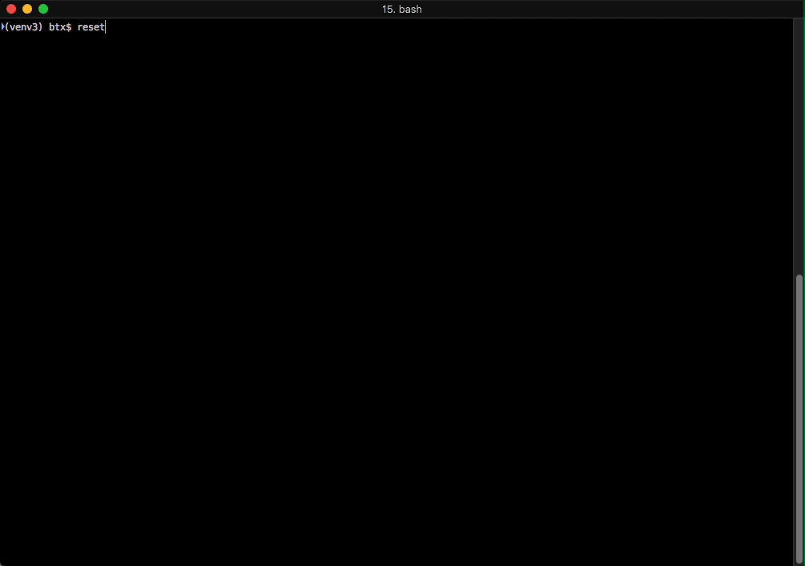

```
                                       oooo         o8o        .o8
                                       `888         `"'       "888
 .ooooo.  oooo d8b  .oooo.    .ooooo.   888  oooo  oooo   .oooo888
d88' `"Y8 `888""8P `P  )88b  d88' `"Y8  888 .8P'   `888  d88' `888
888        888      .oP"888  888        888888.     888  888   888
888   .o8  888     d8(  888  888   .o8  888 `88b.   888  888   888
`Y8bod8P' d888b    `Y888""8o `Y8bod8P' o888o o888o o888o `Y8bod88P"

```
crackid - ComicRack ID Library and Utility

# Introduction #

crackid is a Python3 class library designed to work with comic book .cbr and .cbz files that have ComicInfo.xml files, as produced by by the software ComicRack.  These xml files contain various pieces of metadata about the cbr/cbz file.  It is a widely held belief that these files should only be added by the creator of the content.  This class will allow you to read the files, but it will not allow writing to them.

# Requirements #

* Python 3.6+
* Python dependencies
  * colorama==0.4.1
  * rarfile==3.1
  * docopt>=0.6.2

# Installation #
```
python setup.py install
```

# Usage #
```
* crackid /path/to/comicfile.cbz
* crackid /path/to.directory/containing/books
* crackid /both/directories /and/individual/books.cbz

The crackid program currently only supports console ANSI output

# crackid in use #

